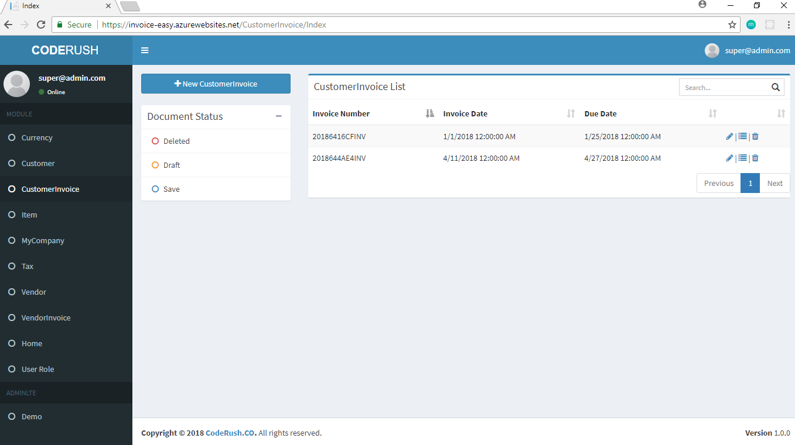
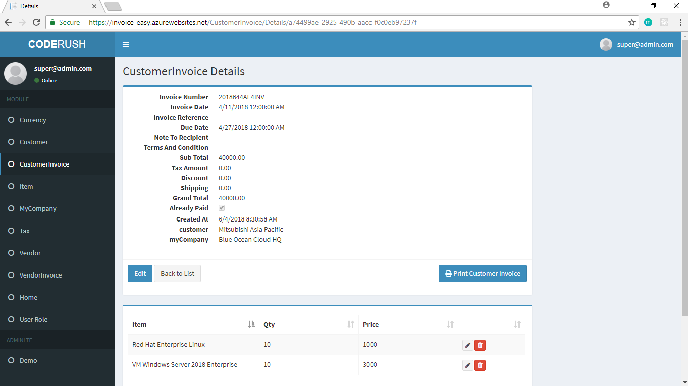
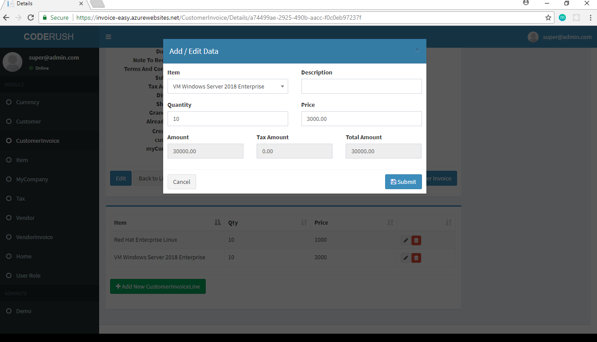
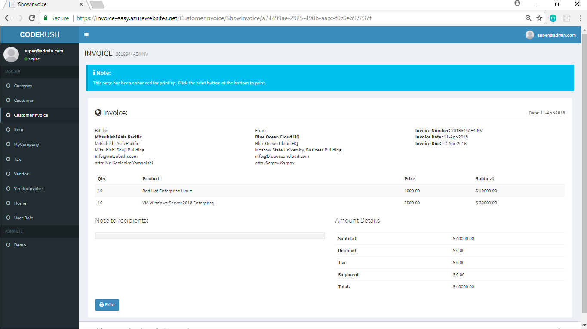

# Invoice
Invoice Web Application Using Bootstrap AdminLTE Template

# Functional Features
- Dashboard Chart
- Currency
- Tax
- Customer
- Vendor
- Product
- Customer Invoice
- Vendor Invoice
- MyCompany / Branch

# Technical Features
- Identity Security
- User Registration
- Roles
- SendGrid Email
- SMTP Email
- Dependency Injection
- ASP.NET Core MVC (version 2)
- C#
- EF Core / Code First
- JQuery

# Development Environment
- Microsoft Visual Studio 2017 Community Edition
- SQL Server Express
- SQL Server Express LocalDB
- Windows 10

# Running The Projects
- Open the project using Visual Studio
- Run the code first migration script via package manager console "update-database"

